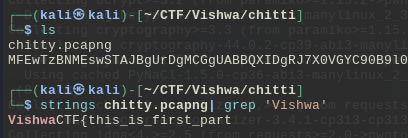
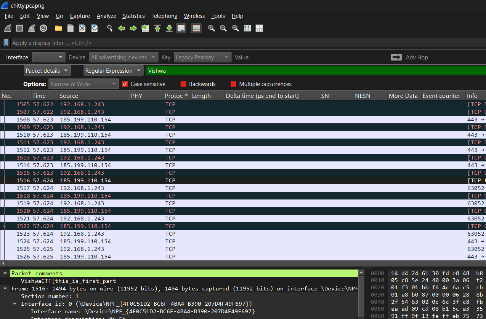
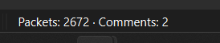
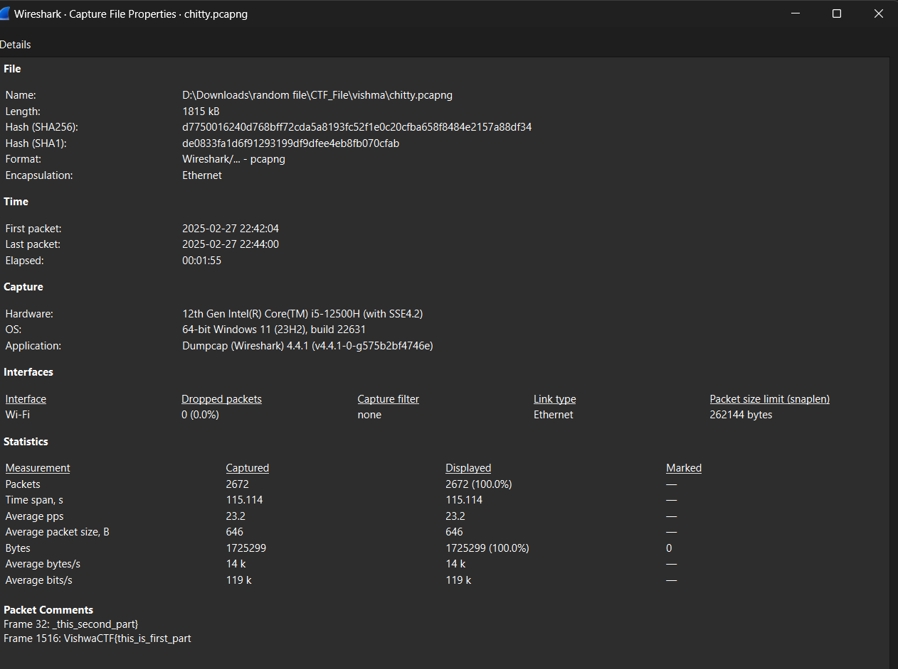

* At first i got the `.pcapng ` file, then i tried to find flag in its strings and i got half of that 
`VishwaCTF{this_is_first_part`

* After that i try to open `.pcapng ` to find another half and i notice something at the end of wireshark page

* Its has 2 comments in this packet so i gotta find another comment
  

* And i saw another half of the flag `_this_second_part} `

  ### Flag

* So the final flag is `VishwaCTF{this_is_first_part_this_second_part}`
