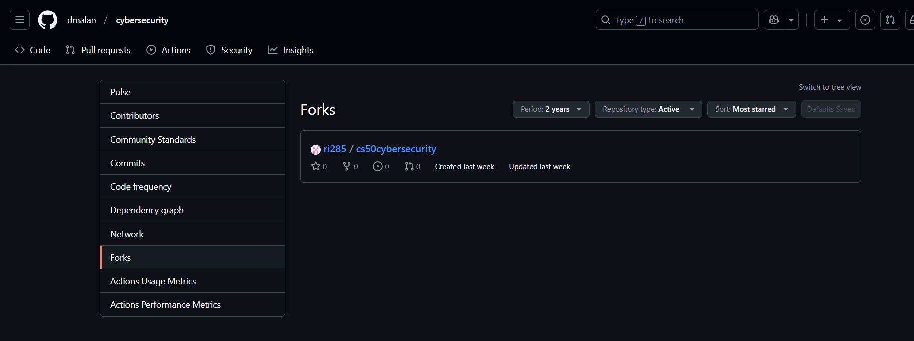
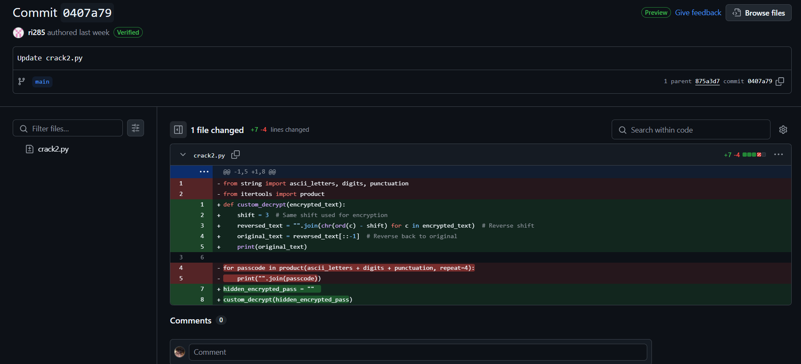

# The Lecture Code
A renowned computer science professor, known for his legendary lectures, once hinted at a hidden message buried within his online presence. Over the years, students speculated about a secret key—a passphrase that unlocks an unknown treasure of knowledge.

Recently, a rumor saying that cryptic message surfaced in an obscure GitHub repository was heard, was it fake or really exists and reveals his secret after all? quack!

Author: Riya @riya_shah28

## Solution 
In the description mention about a professor and "quack" so i immediately think about CS50 "David J. Malan" because i have duck
And in the mr David cybersecurity github there is a sus fork

In ri285 fork has changed the code 

So we have to find the hidden_encrypted_pass and run the script

