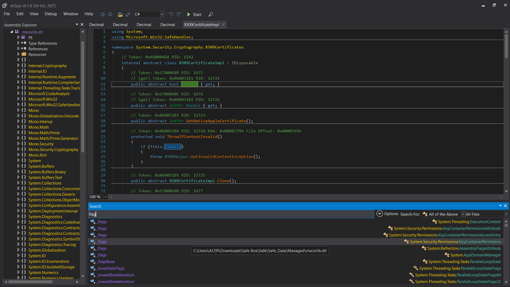

# Safe Box
There are many ways, but the choice is yours. 

Author: Soham @sohamkolte
## Solution
Step 1: I use dnSpy to read "Safe Box\Safe\Safe_Data\Managed\Assembly-CSharp.dll"

But there nothing in it so i go next step
Step 2: I use AssetRipper and i found flag GameObject in level0 Game Scene

So i export the game data
Step 3: I use unity to open the game data and woala

