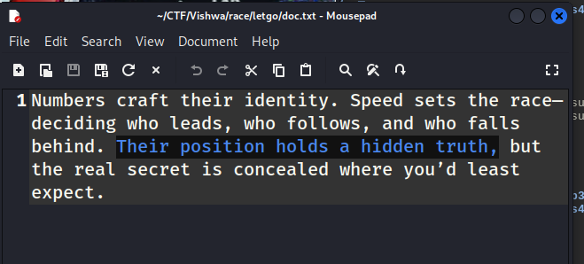
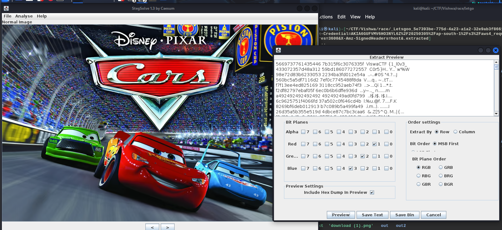

the doc told that message hidden in their position, so i mention that Red car is Top 1 then green and blue are behind 
and i realize it is the positions of bit plane
i used stegsolve to extract the hidden message

