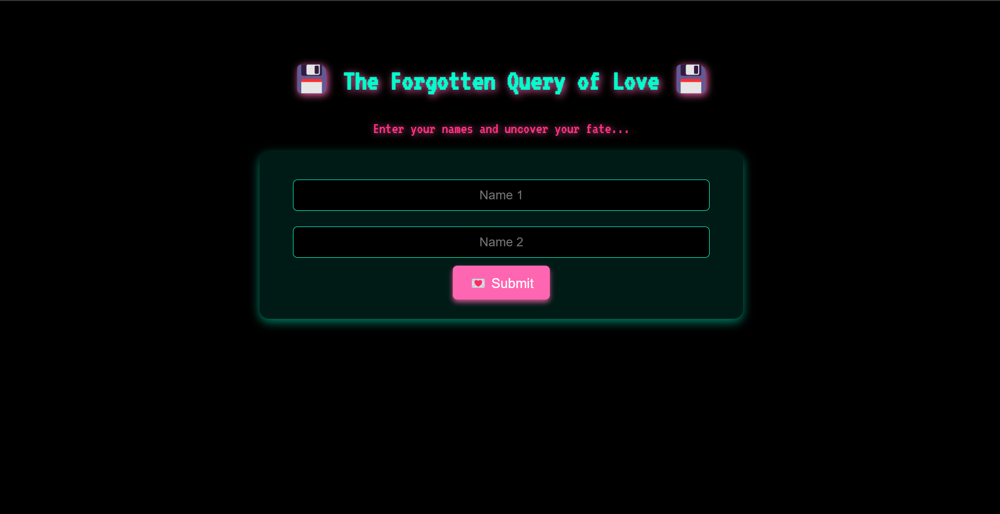
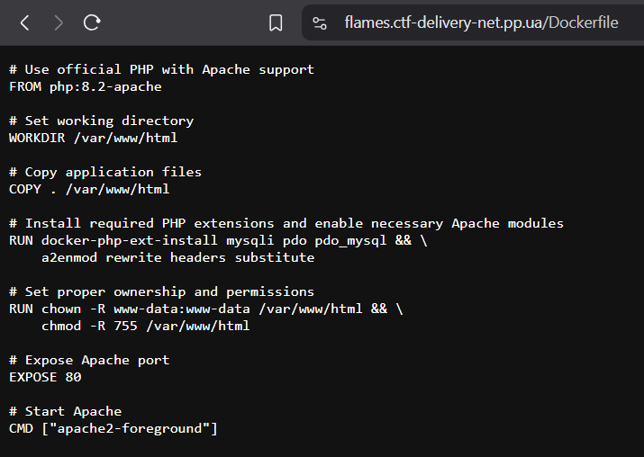
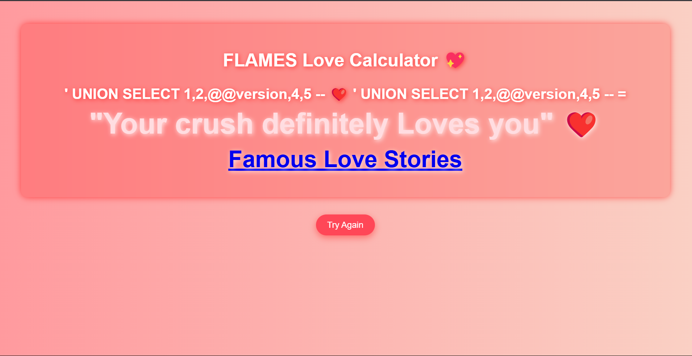
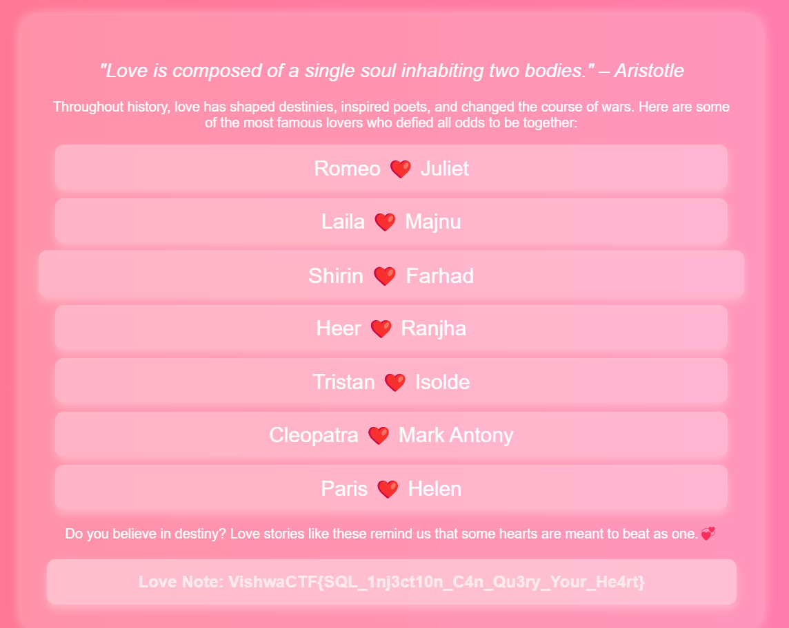

# Flames
Find Your True Love <3.

https://flames.ctf-delivery-net.pp.ua/

Author: Abhinav @.0_0.ace.0_0.

## Solution

Step 1: Analyze, we see that the web hint "Query" and in Dockerfile have Mysql too, so it must be SQL injection

 
Step 2: After try some payload i found this payload

Step 3: Click on the link and you will find the flag

