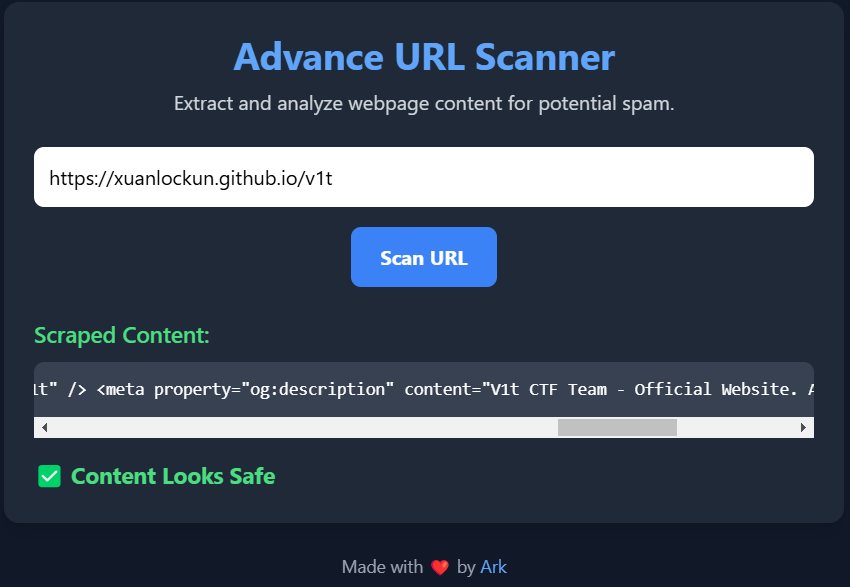

# Scan-it-to-stay-safe
No description was provided.

https://scan-it-to-stay-safe.ctf-delivery-net.pp.ua/

Author: Samarth @ark.dev

## Solution 
Step 1: Analyze we know that the site we visit the link and return the html
 

Step 2: So we put our web hook in it and get the flag (this took a lot of time because i never look at the header of HTTP Get ;-;)

